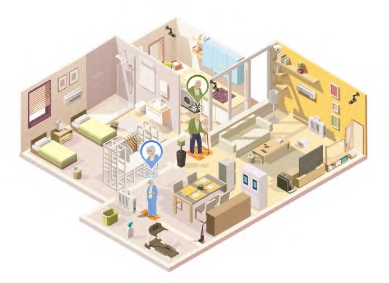
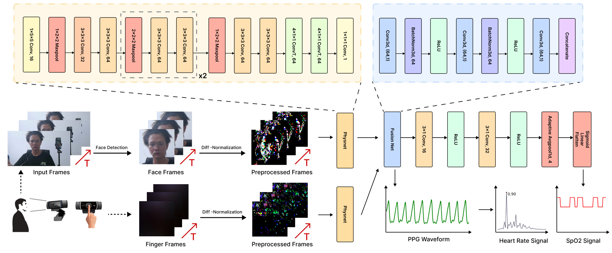
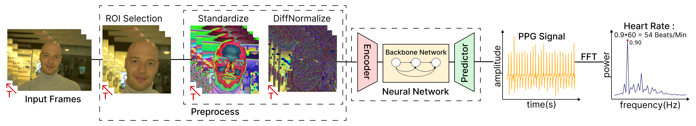
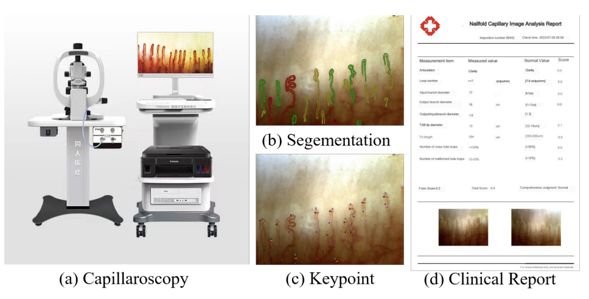
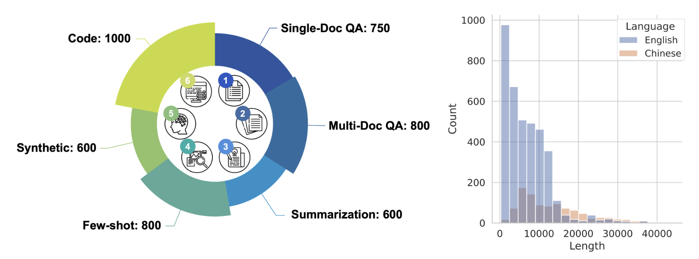
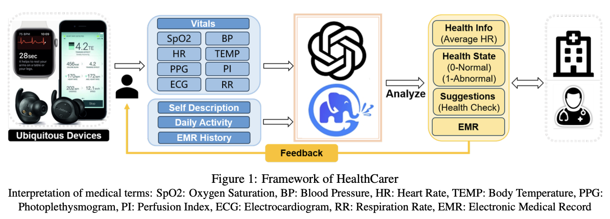
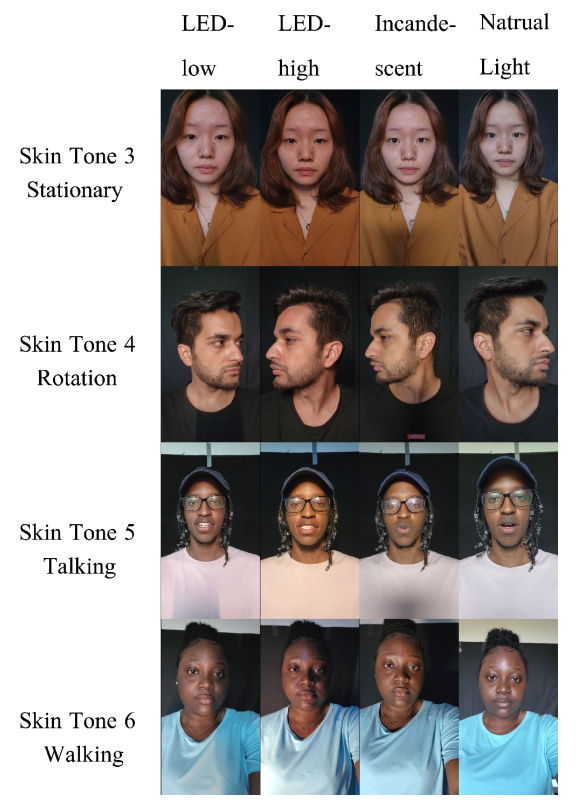
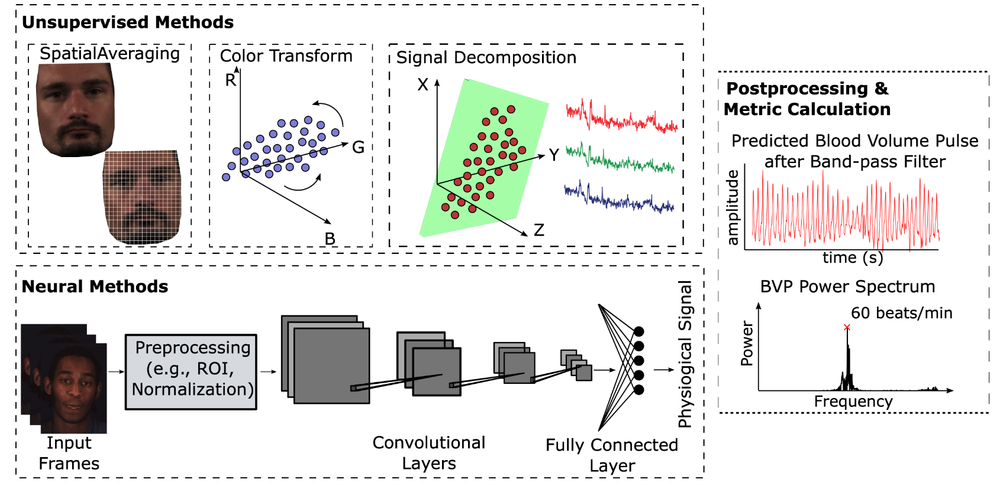








-  I am a student researcher at Tsinghua University🎓. I am now a member of [Pervasive HCI Group](https://pi.cs.tsinghua.edu.cn/), advised by [Prof. Yuanchun Shi](https://scholar.google.com/citations?user=TZm3-pwAAAAJ&hl=zh-CN), [A/Prof. Yuntao Wang](https://scholar.google.com/citations?user=kHpwoAUAAAAJ&hl=zh-CN), and [Prof. Yingqing Xu](https://scholar.google.com/citations?hl=zh-CN&user=zSiDAt4AAAAJ). I have done research in the [Department of Computer Science and Technology](https://www.cs.tsinghua.edu.cn/csen/), [Global Innovation Exchange](https://gix.uw.edu/), [Future Lab](https://thfl.tsinghua.edu.cn/en/), and [School of Vehicle and Mobility](http://www.svm.tsinghua.edu.cn/). I was a researcher at Tsinghua-Toyota AI Center and an intern at [Zhipu AI](https://www.zhipuai.cn/en/) ChatGLM Group. I enjoy working with academia and industry.

- 🔭 My research interests include `Remote Physiological Sensing`, `Pervasive Computing`, `Human-Computer Interaction(HCI)`, `Large Language Models`, and `Computer Vision`. I’m currently working on Biosensing, HCI, and LLM.  
 
- 📫 Reach me through `tjk24@mails.tsinghua.edu.cn` if interested.  

# 🔥 News

**2024.11:** Awarded the **Excellent Graduation Thesis** by Beijing Municipal Education Commission.

**2024.11:** Awarded the **First Prize** in Ubiquitous Intelligent Sensing Technology Innovation Application Competition(Top 5).

**2024.10:** 🎉🎉 Our paper [Summit Vitals: Multi-Camera and Multi-Signal Biosensing at High Altitudes](https://arxiv.org/abs/2409.19223) has been accepted by [UIC'24](https://www.ieee-smart-world.org/2024/uic/) as REGULAR RESEARCH PAPER(Accept Rate: 20.95%).

**2024.9:** 🎉🎉 Attended the [The Inclusion·Conference on the Bund](https://www.inclusionconf.com/) and publish our white paper and [ANT PPG](https://github.com/thuhci/ANT_PPG) dataset.

**2024.7:** 🎉🎉 Awarded the **First Prize** in the National Biomedical Engineering Innovation Competition(Top 5%). 

**2024.6:** 🎉🎉 Give an invited talk at the Commencement Ceremony of Xinya College and awarded **Outstanding Graduate** and **Excellent Graduation Thesis** by Tsinghua University.

**2024.5:** 🎉🎉 Our paper [The EarSAVAS Dataset: Enabling Subject-Aware Vocal Activity Sensing on Earables](https://dl.acm.org/doi/10.1145/3659616) has been accepted by [The Proceedings of the ACM on Interactive, Mobile, Wearable and Ubiquitous Technologies (IMWUT)](https://dl.acm.org/journal/imwut).

**2024.5:** 🎉🎉 Our paper [LongBench: A Bilingual, Multitask Benchmark for Long Context Understanding](https://github.com/THUDM/LongBench)  has been accepted by [ACL 2024](https://2024.aclweb.org/).

**2024.5:** 🎉🎉 Attending [CHI Workshop 2024 PhysioCHI](https://chi2024.acm.org/for-authors/workshops/accepted-workshops/) and present our work [Camera-Based Remote Physiology Sensing for Hundreds of Subjects Across Skin Tones](https://arxiv.org/abs/2404.05003).

**2024.4:** 🎉🎉 Admitted into the Groundbreaking Innovation Talent Development Program(颠覆性创新人才培养项目) at Tsinghua University.

**2024.2:** 🎉🎉 Our paper [A Comprehensive Dataset and Automated Pipeline for Nailfold Capillary Analysis](https://doi.org/10.48550/arXiv.2312.05930) has been accepted by [ISBI 2024](https://biomedicalimaging.org/2024/).

# 📝 Publications 
#### JOURNAL PUBLICATIONS

IMWUT

  
## [The EarSAVAS Dataset: Enabling Subject-Aware Vocal Activity Sensing on Earables ](https://github.com/thuhci/EarSAVAS)

Xiyuxing Zhang, Yuntao Wang, Yuxuan Han, Chen Liang, Ishan Chatterjee, **Jiankai Tang**, Xin Yi, Shwetak Patel, and Yuanchun Shi

[IMWUT](https://dl.acm.org/journal/imwut)

    <a class="_blank" href="https://dl.acm.org/doi/10.1145/3659616" >
        <i class="fas fa-newspaper" aria-hidden="true"></i> Paper
    </a>
  <a class="_blank" href="https://github.com/thuhci/EarSAVAS">
        <i class="ai ai-open-access ai-1x" aria-hidden="true"></i> Code
    </a>

NN

<!-- --------------------------------------------------------------------------------------------------------------- -->

## [Spiking-PhysFormer: Camera-Based Remote Photoplethysmography with Parallel Spike-driven Transformer ](https://github.com/Arktis2022/Spiking-PhysFormer)

Mingxuan Liu\*, **Jiankai Tang\*** (\*Co-first Author), Haoxiang Li, Jiahao Qi, Siwei Li, Kegang Wang, Yuntao Wang, Hong Chen

Neural Networks, Under Review

    <a class="_blank" href="https://arxiv.org/abs/2402.04798" >
        <i class="fas fa-newspaper" aria-hidden="true"></i> Paper
    </a>
  <a class="_blank" href="https://github.com/Arktis2022/Spiking-PhysFormer">
        <i class="ai ai-open-access ai-1x" aria-hidden="true"></i> Code
    </a>

JCAD

<!-- --------------------------------------------------------------------------------------------------------------- -->
  
## A Method of Privacy-Friendly Gait Data Acquisition and Emotion Recognition

Hong Xiao, **Jiankai Tang**, Christine Qiu, Xinyi Fu

[JCAD](https://www.jcad.cn/)

    <a class="_blank" href="https://kns.cnki.net/kcms2/article/abstract?v=ebrKgZyeBkxJAkKmLRGB8ZBzoL0_JE1z5CJDrfO0vn9sAN5P7cZCI7TMzal9BZkSQQ-tNRL5sj5jZJV8Erzh5u0t4amz6h_o_KdkPSubDPVnvkfMkClSYlPa5iaNSWFktEGmXFOfGWIXzhFL20NQyw==&uniplatform=NZKPT&language=CHS" >
        <i class="fas fa-newspaper" aria-hidden="true"></i> Paper
    </a>

<!-- --------------------------------------------------------------------------------------------------------------- -->

#### CONFERENCE PUBLICATIONS

<!-- --------------------------------------------------------------------------------------------------------------- -->

UIC 2024

## [Summit Vitals: Multi-Camera and Multi-Signal Biosensing at High Altitudes ](https://github.com/thuhci/SUMS)

Ke Liu*, **Jiankai Tang**(Co-first Author), Zhang Jiang, Yuntao Wang, Xiaojing Liu, Dong Li, Yuanchun Shi

[UIC'24](https://www.ieee-smart-world.org/2024/uic/). 

    <a class="_blank" href="https://arxiv.org/abs/2409.19223" >
        <i class="fas fa-newspaper" aria-hidden="true"></i> Paper
    </a>
      <a class="_blank" href="https://github.com/thuhci/SMUS">
        <i class="ai ai-open-access ai-1x" aria-hidden="true"></i> Code
    </a>

<!-- --------------------------------------------------------------------------------------------------------------- -->

<!-- --------------------------------------------------------------------------------------------------------------- -->

PhysioCHI 2024

## [Camera-Based Remote Physiology Sensing for Hundreds of Subjects Across Skin Tones ](https://github.com/Health-HCI-Group/Largest_rPPG_Dataset_Evaluation)

**Jiankai Tang\***, Xinyi Li\*(\*Co-first Author), Jiacheng Liu, Xiyuxing Zhang, Zeyu Wang, Yuntao Wang

[CHI Workshop PhysioCHI 2024](https://chi2024.acm.org/for-authors/workshops/accepted-workshops/). 

    <a class="_blank" href="https://arxiv.org/abs/2404.05003" >
        <i class="fas fa-newspaper" aria-hidden="true"></i> Paper
    </a>
      <a class="_blank" href="https://github.com/Health-HCI-Group/Largest_rPPG_Dataset_Evaluation">
        <i class="ai ai-open-access ai-1x" aria-hidden="true"></i> Code
    </a>

<!-- --------------------------------------------------------------------------------------------------------------- -->

ISBI 2024

## [A Comprehensive Dataset and Automated Pipeline for Nailfold Capillary Analysis ](https://github.com/THU-CS-PI-LAB/ANFC-Automated-Nailfold-Capillary)

Linxi Zhao, **Jiankai Tang**, Dongyu Chen, Xiaohong Liu, Yong Zhou, Guangyu Wang, Yuntao Wang

[ISBI 2024](https://biomedicalimaging.org/2024/). 

    <a class="_blank" href="arxiv.org/abs/2312.05930" >
        <i class="fas fa-newspaper" aria-hidden="true"></i> Paper
    </a>
      <a class="_blank" href="https://github.com/THU-CS-PI-LAB/ANFC-Automated-Nailfold-Capillary">
        <i class="ai ai-open-access ai-1x" aria-hidden="true"></i> Code
    </a>

ACL 24

## [LongBench: A Bilingual, Multitask Benchmark for Long Context Understanding ](https://github.com/THUDM/LongBench)

Yushi Bai, Xin Lv, Jiajie Zhang, Hongchang Lyu, **Jiankai Tang**, Zhidian Huang, Zhengxiao Du, Xiao Liu, Aohan Zeng, Lei Hou, Yuxiao Dong, Jie Tang, Juanzi Li

ACL 24

    <a class="_blank" href="https://arxiv.org/abs/2308.14508" >
        <i class="fas fa-newspaper" aria-hidden="true"></i> Paper
    </a>
      <a class="_blank" href="https://github.com/THUDM/LongBench">
        <i class="ai ai-open-access ai-1x" aria-hidden="true"></i> Code
    </a>

AI Health Summit 2023

## [ALPHA: AnomaLous Physiological Health Assessment Using Large Language Models ](https://github.com/McJackTang/LLM-HealthAssistant)

**Jiankai Tang**, Kegang Wang, Hongming Hu, Xiyuxing Zhang, Peiyu Wang, Xin Liu, Yuntao Wang

[AI Health Summit 2023](https://healthsummit.ai/main/abstracts/). 

    <a class="_blank" href="https://arxiv.org/abs/2311.12524" >
        <i class="fas fa-newspaper" aria-hidden="true"></i> Paper
    </a>
      <a class="_blank" href="https://github.com/McJackTang/LLM-HealthAssistant">
        <i class="ai ai-open-access ai-1x" aria-hidden="true"></i> Code
    </a>

EMBC 2023

## [MMPD: Multi-Domain Mobile Video Physiology Dataset ](https://github.com/McJackTang/MMPD_rPPG_dataset)

**Jiankai Tang**, Kequan Chen, Yuntao Wang, Yuanchun Shi, Shwetak Patel, Daniel McDuff, Xin Liu

[IEEE EMBC 2023](https://embc.embs.org/2023/) (Oral)

    <a class="_blank" href="https://arxiv.org/abs/2302.03840" >
        <i class="fas fa-newspaper" aria-hidden="true"></i> Paper
    </a>
    <a class="_blank" href="https://github.com/McJackTang/MMPD_rPPG_dataset">
        <i class="ai ai-open-access ai-1x" aria-hidden="true"></i> Code
    </a>

NeurIPS 2023

## [rPPG-Toolbox: Deep Remote PPG Toolbox ](https://github.com/ubicomplab/rPPG-Toolbox)

Xin Liu, Girish Narayanswamy, Akshay Paruchuri, Xiaoyu Zhang, **Jiankai Tang**, Yuzhe Zhang, Yuntao Wang, Soumyadip Sengupta, Shwetak Patel, Daniel McDuff

[NeurIPS 2023](https://neurips.cc/)

    <a class="_blank" href="https://arxiv.org/abs/2210.00716" >
        <i class="fas fa-newspaper" aria-hidden="true"></i> Paper
    </a>
    <a class="_blank" href="https://github.com/ubicomplab/rPPG-Toolbox">
        <i class="ai ai-open-access ai-1x" aria-hidden="true"></i> Code
    </a>

# 🎖 Honors and Awards
- *2024* **Excellent Graduation Thesis**, Beijing Municipal Education Commission(Top 0.8%).
- *2024* **First Prize** in Ubiquitous Intelligent Sensing Technology Innovation Application Competition(Top 5).
- *2024* **First Prize** in the National Biomedical Engineering Innovation Competition(Top 5%). 
- *2024* **Excellent Graduation Thesis** at Tsinghua University（Top 1 in Department）.
- *2024* **Outstanding Graduate** at Tsinghua University（Top 10%）.
- *2024* **Best Presentation Award** at Tsinghua University Initiative Scientific Research Program Forum(Top 5).
- *2023* **National Scholarship, Ministry of Education**, P.R. China (Top 1 in Department)   &nbsp; &nbsp; &nbsp; *Top scholarship in China. 0.2% domestically*.
- *2023* **Scholarship for Social Work Excellence**, Tsinghua University
- *2023* **Scholarship for Science and Technology Innovation Excellence**, Tsinghua University
- *2022* **Scholarship for Social Work Excellence**, Tsinghua University
- *2022* **Scholarship for Science and Technology Innovation Excellence**, Tsinghua University
- *2021* **Scholarship for Social Work Excellence**, Tsinghua University

# 📖 Educations
- *2024.06 - 2027.06*, the Department of Computer Science and Technology, Tsinghua University
  - 2024.09-2026.09, Medical & Engineering Improvement Program, Tsinghua University
- *2019.06 - 2024.06*, Creative Design and Intelligent Engineering(CDIE, 智班), double majors in Automation and Industrial Design, Xinya College, Tsinghua University
  - 2022.7-2023.7, Artificial Intelligence Innovation and Entrepreneurship Program, Tsinghua University
  - 2023.6-2023.9, Access Computing Summer Program, Tsinghua University/University of Washington/GIX
  - 2022.1, Artificial Intelligence and Machine Learning Winter Program, Oxford University
    
<!-- 

  
  
  
  

-->

# 💬 Invited Talks
- *2024.06*, Commencement Ceremony, Xinya College, Tsinghua University
- *2024.04*, LLM Applications in Social Work, Tsinghua University
- *2023.07*, MMPD Presentation, IEEE Engineering in Medicine and Biology Society
- *2022.12*, Creative Software, Xinya College, Tsinghua University
- *2022.05*, Patent Writing, Xinya College, Tsinghua University

# 💻 Internships
- *2024.01 - Now*, [Ant Group](https://www.antgroup.com/) Pedcha Lab, China.
- *2023.06 - 2023.11*, [Zhipu AI](https://www.zhipuai.cn/en/) ChatGLM Group, China.

<!-- 

  
  

-->

# 👨🏻‍🎓 Service and Leadership
- Conference Reviewers: MobileHCI'24
- Journal Reviewers: IMWUT
- 2024-Now: Science and Innovation Mentor, Xinya College, Tsinghua University
- 2023-Now: Chairman of Hunan Culture Association,  Tsinghua University
- 2021-2023: Leader of Creative Design and Intelligent Engineering. CDIE9 was honored with the award of “Excellent Academic Class”.
- 2022-2023: Vice president of the Science and Innovation Association, Xinya College.
  
# 🔗 LINKS
Pervasive HCI Group: [The lab for Pervasive Computing and Human-Computer Interaction at Tsinghua](https://pi.cs.tsinghua.edu.cn/) Yuntao Wang: [Associate Professor, Department of Computer Science and Technology, Tsinghua University](https://pi.cs.tsinghua.edu.cn/lab/people/YuntaoWang/) Xin Liu: [Research Scientist, Google Consumer Health Research and a research affiliate, the Paul G. Allen School of Computer Science & Engineering, University of Washington](https://xliucs.github.io/) Mingxuan Liu: [Department of Biomedical Engineering, Tsinghua University](https://arktis2022.github.io/)

<!-- 
## Hidden Content 
  **2023.12:** 🎉🎉 Awarded **Best Presentation** at Tsinghua University Initiative Scientific Research Program Forum.
  
  **2023.11:** Attended the AI Health Summit 2023 held in Singapore and posted a [poster](https://arxiv.org/abs/2311.12524) about Anomalous Physiological Health Assessment Using Large Language Models.
  
  **2023.11:** 🎉🎉 Hosting a research project on non-contact physiological indication perception based on camera technology, awarded funding by the **Beijing Natural Science Foundation**.
  
  **2023.10:** 🎉🎉 Awarded **National Scholarship** by Ministry of Education!
  
  **2023.10:** 🎉🎉 Our paper addressed [rPPG Toolbox](https://arxiv.org/abs/2210.00716) has been accepted by [NeurIPS 2023](https://neurips.cc/).
  
  **2023.7:** Attended the [EMBC 2023](https://embc.embs.org/2023/) and gave an [oral presentation](https://arxiv.org/abs/2302.03840) about new comprehensive rPPG dataset.
  
  **2023.3:** 🎉🎉 Our paper addressed [Privacy-Friendly Gait Data Acquisition and Emotion Recognition](https://kns.cnki.net/kcms2/article/abstract?v=ebrKgZyeBkxJAkKmLRGB8ZBzoL0_JE1z5CJDrfO0vn9sAN5P7cZCI7TMzal9BZkSQQ-tNRL5sj5jZJV8Erzh5u0t4amz6h_o_KdkPSubDPVnvkfMkClSYlPa5iaNSWFktEGmXFOfGWIXzhFL20NQyw==&uniplatform=NZKPT&language=CHS) has been accepted by [JCAD](https://www.jcad.cn/).
-->
